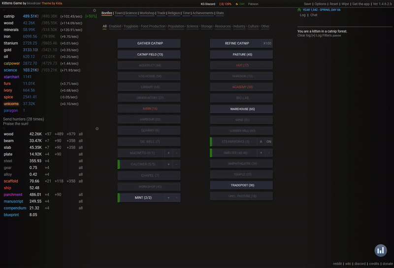

# ktns

A real-time [Kittens Game](http://bloodrizer.ru/games/kittens/#) resource visualization engine.

## Features

* Display individual resource values
* Project resource levels 5 and 15 minutes into the future based on current rates
* Display maximum total resource levels
* At-a-glance ability to tell where you are resource-capped
* Hovering over Bonfire tab action buttons projects a red marker in the chart to show how much of a given resource that action will consume

## See it in action

## Installation

* Requires [Tampermonkey v4.8](https://www.tampermonkey.net/) or greater

1. [Click this link](https://raw.githubusercontent.com/jonrhall/ktns/master/dist/ktns.user.js) and Tampermonkey should prompt you to install.
2. Open the Kittens Game itself (or refresh if you had the page open).
3. You're done! There should be a graph in the bottom right of your window like this:\
  

## More information

Each resource chart will have the following properties:\

